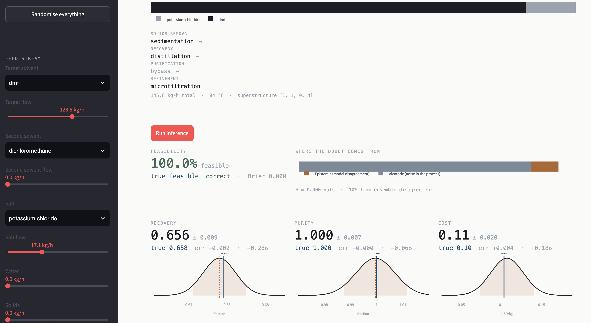

# ML Superstructure Solvent Recovery

A PyTorch implementation of uncertainty-aware deep ensemble surrogate for the
solvent recovery superstructure of Chea et al. (2020). Predicts feasibility,
recovery, purity and cost/kg for any pathway, with aleatoric/epistemic
uncertainty decomposition and active learning.

## Features
- Deep ensemble (M=5) with heteroscedastic heads
- Uncertainty decomposition (epistemic vs. aleatoric)
- Active learning with $\epsilon$-greedy acquisition
- Post-hoc calibration (STD/temperature scaling)
- Browser-based visualiser

## Installation
    git clone https://github.com/maxjappert/ml-superstructure-solvent-recovery.git
    pip install -r requirements.txt

Implemented using Python version 3.14.6. A standard CPU is sufficiently powerful for evaluation.

## Usage
    python create_dataset.py [train/val/test/calibration] [size] [seed] 
    python train.py
    python evaluate.py
    streamlit run visualiser.py

## Repository structure
The project directory contains the following files:

- `active_learner.py`: Contains the active learning implementation.
- `config.py`: Specifies the hyperparameters, seed and settings for all the experiments.
- `create_dataset.py`: The functions necessary for creating a dataset in the required format as `.csv`.
- `dataset_torch.py`: Necessary code for converting the `.csv`-data to tensors that PyTorch can work with.
- `evaluate.py`: Everything pertaining to the evaluation of a trained model and running experiments. Its main function reproduces many of the results in the paper.
- `models.py`: Handles the model implementation and the conversion between different model output formats.
- `train.py`: The train script and associated methods.
- `solvent_recovery_data_generator/`: Contains the re-written Chea et al. (2020) framework containing the 'oracle'. It is used for generating training data.
- `utils.py`: Helper functions.
- `visualiser.py`: The interactive visualiser of the model's predictions. It runs in the browser and was implemented with `streamlit`.

## Reproducing the report results
The reported results can be reproduced using the exact configuration (seed and hyperparameters) specified in the code.

## Reference
- [Chea et al. (2020)](https://pubs.acs.org/doi/10.1021/acs.iecr.9b06725)
- [Granacher et al. (2021)](https://www.frontiersin.org/articles/10.3389/fceng.2021.778876/full)
- [Guo et al. (2017)](https://arxiv.org/abs/1706.04599)
- [Kuleshov et al. (2018)](http://arxiv.org/abs/1807.00263)
- [Lakshminarayanan et al. (2017)](https://arxiv.org/abs/1612.01474)

## Authors
This project was implemented and conceptualised by [Max Jappert](https://maxja.net) in July 2026.

## License
The software is property of the [Institute for Ecopreneurship](https://www.fhnw.ch/en/life-sciences/about/institutes/ecopreneurship) at the [University of Applied Sciences and Arts Northwestern Switzerland  (FHNW)](https://www.fhnw.ch/de).